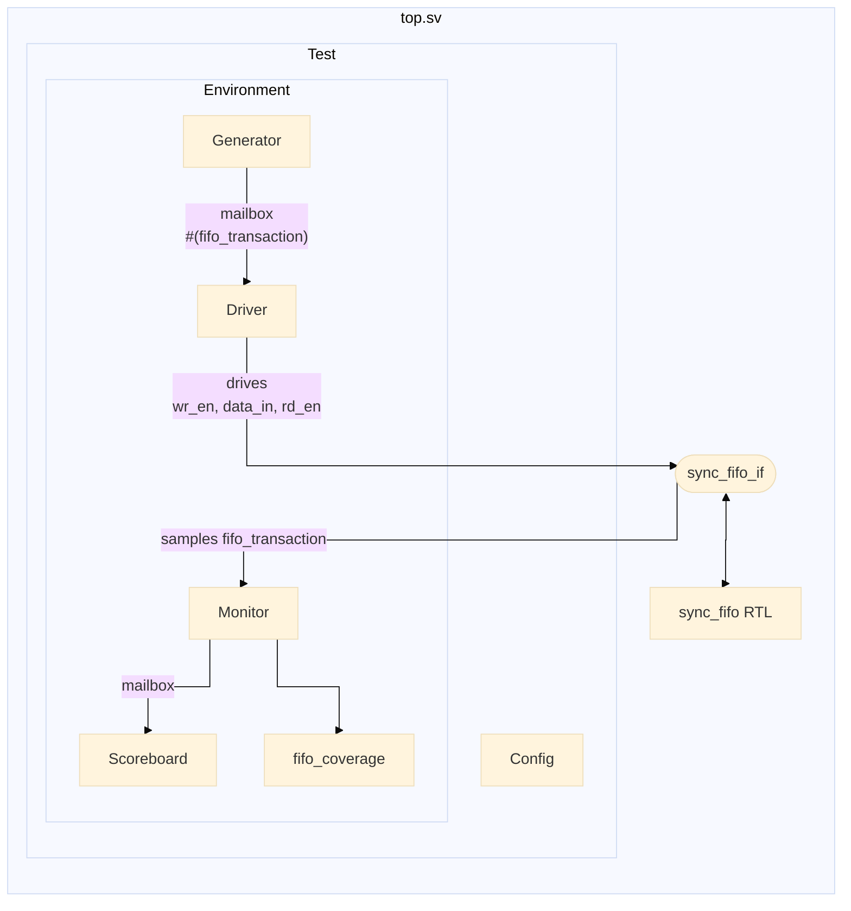

# Synchronous FIFO Verification Environment

This repository contains a SystemVerilog verification environment for a Synchronous FIFO memory module. The environment relies on Constrained Random Verification (CRV), functional coverage collection, and automated self-checking scoreboards.

## Architecture & Verification Components

The testbench is structured into class-based components using SystemVerilog OOP practices and virtual interfaces:



* **Generator** (at `tb/generator.sv`): Instantiates and randomizes 
`fifo_transaction` objects according to distribution probabilities specified in a `Config` object.
* **Driver** (at `tb/driver.sv`): Pulls transactions from the Generator mailbox and drives interface signals according to DUT clocking block timing.
* **Monitor** (at `tb/monitor.sv`): Passively samples the virtual interface on clocking block events, tracking write requests, read responses, and DUT status flags.
* **Scoreboard** (at `tb/scoreaboard.sv`): Implements an internal reference queue (`golden_queue`) to validate data integrity and handle concurrent Read/Write (`R/W`) operations when the FIFO is full.
* **Coverage Collector** (`tb/coverage.sv`): Tracks functional coverpoints for FIFO status flags, write/read operation types, and cross-coverage for simultaneous operations.

The stimulus are driven and observed through an interface at `tb/sync_fifo_if.sv`, 
declared as virtual in the components that use it. The interface is also used as
the port definition in the RTL code and the assertion module, and contains clocking
blocks and modports for DUT, Monitor and Driver/Testbench perspective. 

The DUT, the interface and the assertion module (bounded to the dut) and the 
test itself are instantiated in the `top` module. The testbench components are 
instantiated inside a `Environment` (at `environment.sv`) class, that can be 
configured, and the env is instantiated by the test. The Monitor observes the interface and triggers the coverage sampling at every clock, but sends to the 
Scoreboard only the write requests and the read responses (interface state one clock
edge after the read request) so it can be compared. Althought using CRV, only two test
cases (TestDefault and TestWriteHeavy) are enough to reach 100% functional coverage.


## Directory Structure

* `tb/`: Testbench source files (generator, driver, monitor, scoreboard, coverage, tests, assertions, and top module).
* `fifo.sv`: Synchronous FIFO RTL implementation.
* `files.f`: Compilation file list for Synopsys VCS.
* `Makefile`: Simulation and coverage build automation scripts.

## Running Simulations

The Makefile organizes build artifacts and logs inside a `build/` directory to maintain a clean workspace.

### Commands

* **Compile and run default test**:
```bash
make

```


* **Run simulation only**:
```bash
make run

```


* **Generate coverage report (Synopsys URG)**:
```bash
make cov

```


* **Clean build artifacts**:
```bash
make clean

```
